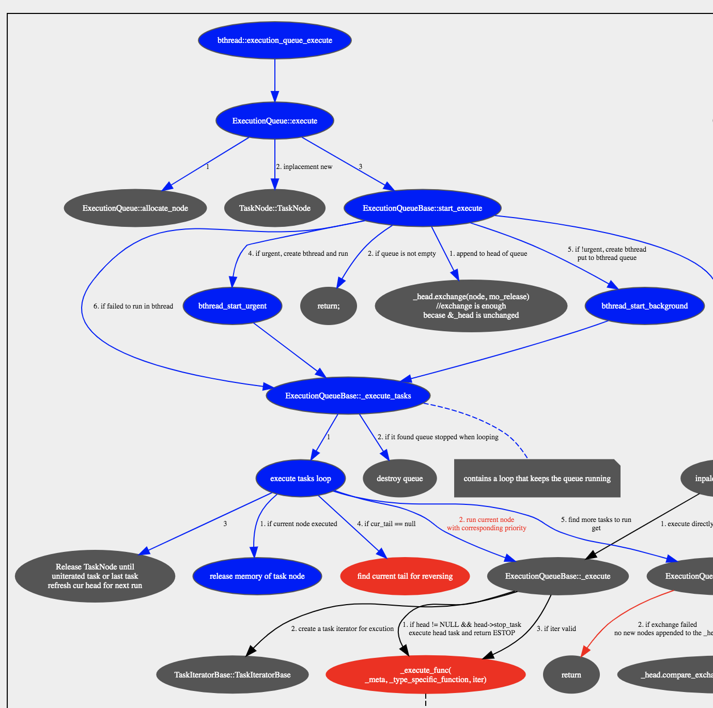
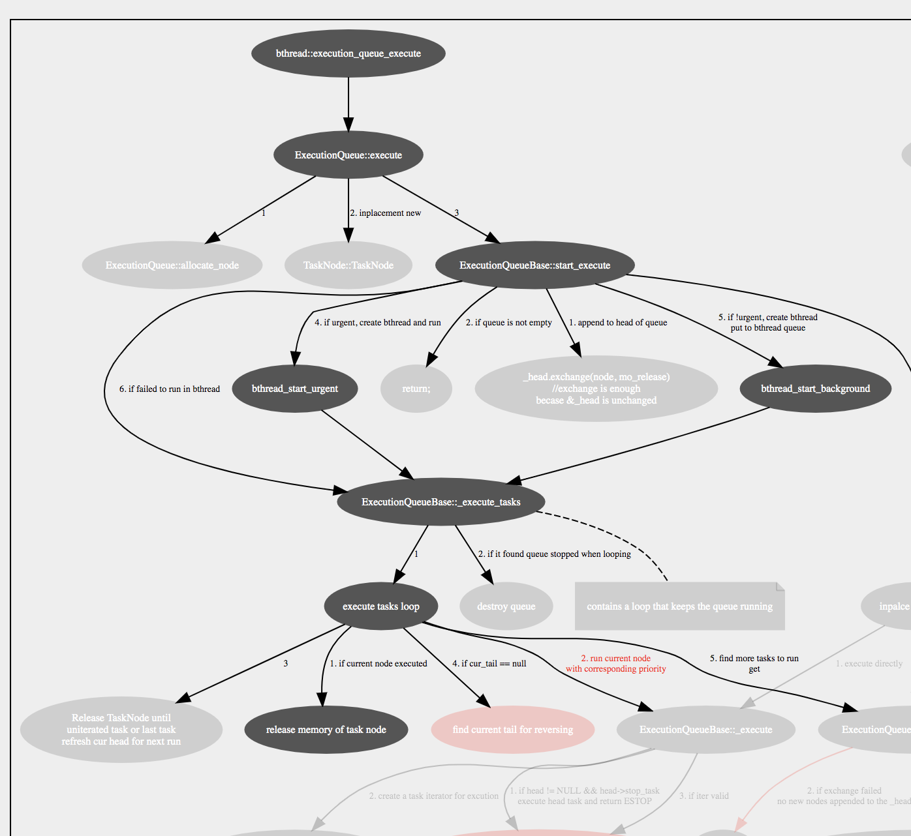

## graphviz-generated svg highlight plugin

This is a build tool integrates interactive plugin (javascript) to svg file
generated by [graphviz dot](http://graphviz.org/doc/info/lang.html).

It makes svg more interactive, especially for call graphs,
by injecting javascript code without any auxiliary external files (except jquery).

Style 1: highlight with color
Click on the element and call path will be highlighted in blue.



Style 2: highlight with opacity
Click on the element and call path will be highlighted, and the other elements
will be faded away.



### Prerequisites

There are some command line utilities  

0. `dot` - graphviz version 2.x or 3.0
	* new versions should work, if not I will fix it
	* older versions may work, but they are not tested yet, I am lazy...
1. `sed`, both gnu version and BSD version are good to go
2. ~~`cat`, every unix-like system should have this command~~
3. ~~web browsers, Chrome or Safari, everyone should have a browser...~~

Here is an example to install graphviz 3.0, it works both on Linux and MacOSX.
(You may change the installation path as needed.)

```shell
# install graphviz dependency
wget https://github.com/libexpat/libexpat/releases/download/R_2_4_8/expat-2.4.8.tar.bz2 --no-check-certificate
tar xf expat-2.4.8.tar.bz2
pushd expat-2.4.8
./configure --prefix=$HOME/opt/expat/expat-2.4.8
make install -j8
popd

# install graphviz
wget https://gitlab.com/api/v4/projects/4207231/packages/generic/graphviz-releases/3.0.0/graphviz-3.0.0.tar.xz --no-check-certificate
tar xf graphviz-3.0.0.tar.xz
pushd graphviz-3.0.0
./configure --prefix=$HOME/opt/graphviz/graphviz-3.0.0 --with-expat=yes --with-expatincludedir=$HOME/opt/expat/expat-2.4.8/include --with-expatlibdir=$HOME/opt/expat/expat-2.4.8/lib
make install -j8
# to make command `dot` visible, you can also modify the PATH env. var. as you like
alias dot=$HOME/opt/graphviz/graphviz-3.0.0/bin/dot
popd

# install this build tool
git clone https://github.com/gavinchou/dot-build-tool.git
cd dot-build-tool
sh build_call_graph.sh demo.dot test.svg

# open test.svg in a web browser like Chrome to view the result
# for MacOSX you can type to open with chrome
open -a 'google chrome' test.svg
# or, for MacOSX you can type to open with safari
open -a 'safari' test.svg

# enjoy
```

<font color="#ff0000">
Note: you also need to connect to the Internet for fetching jquery when the browser loads svg.
</font>

### Usage

```
sh build_call_graph.sh ${src} ${out}
```

where `src` is input .dot file name, and `out` is output .svg file name.
let's say the output is a.svg, when it's done, open a.svg with any browser.

### How it works
1. use graphviz `dot` to generate .svg file from .dot file
	let's say the output is a.svg and input is a.dot
2. replace the last line of a.svg, `</svg>`, with content of
	 `call_graph_highlight_plugin.xml`
3. append `</svg>` to a.svg again

Note that, if you already have a .svg file, you can do step 2 and 3 manually to
embed.

### Configurations
Besides [styles](#build-your-own-style), there are several configurations we can
set (append to URL args `?conf=val`):

1. dontShowInstruction: whether prompt instruction when svg is loaded
2. resizeViewOnLoad: whether fit the svg to browser window size, it's useful for
	 large svg.
3. focus: to focus on a node when svg is loaded, the `val` is a node name
4. ...

Here is an example how to use URL arg configurations.

By default a prompt of how to control the svg will show up when svg is
loaded, to disable that prompt, we can put `dontShowInstruction=true` URL args,

launch from MaxOSX command line

```
open -a 'google chrome' "test.svg?dontShowInstruction=true"
```

or in the browser address line

```
file:///Users/username/test.svg?dontShowInstruction=true
```

Besides URL args setting, we can also set some configuration when we are writing
dot-lang source code, we can add an invisible node named `__graph_js_config__`

```
// The script in attr label will be executed while loading the svg.
// Invisable style will be translated to XML comment, hence, we need to make
// the color to transparent instead of style=invis
__graph_js_config__ [label="gDontShowInstruction=true;gResizeViewOnLoad=false;" shape=plaintext fontcolor="#00000001" id="\N"]
```

Note: for more configurations, pls read the friendly source code.

<a name="build-your-own-style"></a>

### Build you own style

As you can see, the secret is all in `call_graph_highlight_plugin.xml`. To
customize styles or add more features, you need to modify it.

The default style is highlight with color blue, and you can switch to the other
style by modifying `<script>` section of  `call_graph_highlight_plugin.xml`

```
// configure to switch hilight effect
const HILIGHT = 1;
const FADE = 2;
var style = FADE; // change this to FADE
```

If the built-in styles are not what your favor, you can build your own style by
modifying the `<style>` section of the xml file

```
<style>
.node {
  fill: blue;
}
.node:hover {
  fill: lightblue;
}
.fade {
  opacity: 0.2;
}
.fade:hover {
  opacity: 1.0;
}
.arrow-path {
  stroke: blue;
}
.arrow-head-tail {
  fill: blue;
  stroke: blue;
}
</style>
```

Note: for more styles, you need to know something about css and javascript.
